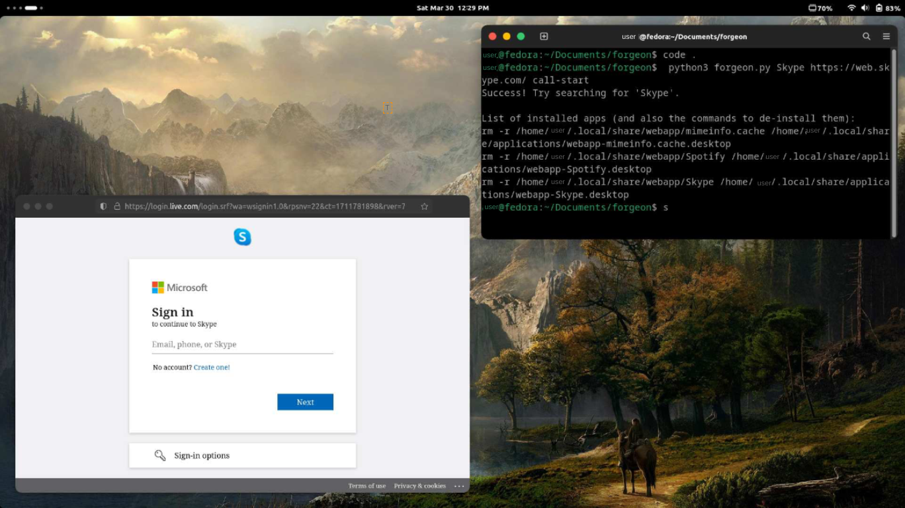

# Forgeon: Standalone Web Apps for Firefox

## Introduction

Forgeon brings back the much-loved functionality of standalone web apps in Firefox. Tested with Firefox versions 96 to 124 and Gnome 3,4 on both Wayland and X11, this Python script offers a lightweight and streamlined alternative to Electron frameworks. 

## Features

- **Standalone Web App Experience**: Launch your favorite web apps as independent windows, just like the pre-deprecation era.
- **Simple Setup**: Easy-to-understand Python code with clear comments for effortless customization.
- **Cross-Environment Compatibility** (work in progress): Tested successfully on both Wayland and X11.

## Current Limitations

- This project is a work in progress, and your contributions are essential for improvement.

## Installation & Usage

1. Clone the repository:
   ```
   git clone https://github.com/Alimiyan/App-Builder.git
   ```
2. Navigate to the project directory:
   ```
   cd App-Builder
   ```
3. Run the script:
   ```
   python forgeon.py
   ```

Feel free to report issues, suggest improvements, or contribute code!

## Example Usage

```
(venv) [user@linux forgeon]$ python3 forgeon.py Skype https://web.skype.com/ call-start
Success! Try searching for 'Skype'.

List of installed apps (and commands to de-install them):
rm -r /home/user/.local/share/webapp/WhatsApp /home/user/.local/share/applications/webapp-WhatsApp.desktop
rm -r /home/user/.local/share/webapp/Agenda /home/user/.local/share/applications/webapp-Agenda.desktop
rm -r /home/user/.local/share/webapp/Skype /home/user/.local/share/applications/webapp-Skype.desktop
(venv) [user@linux forgeon]$ rm -r /home/user/.local/share/webapp/Skype /home/user/.local/share/applications/webapp-Skype.desktop
```



## Icon Options

### Provide an Icon Name

- Pass the desired icon name as the third argument to forgeon.
- This name will be directly used in the .desktop file.
- Example: `forgeon https://example.com "My Web App" my_app.desktop`

### Automatic Download (Requires favicon package)

- If you don't specify an icon name, forgeon attempts to download the largest icon from the web application.
- Requires the favicon Python package (Install via `pip install favicon`).
- Note: This requires internet access and may not work due to website restrictions.

### Choosing the Right Method

- If you have a specific icon in mind, providing the name directly is more controlled.
- The automatic download is convenient with favicon installed, but be aware of its limitations.
